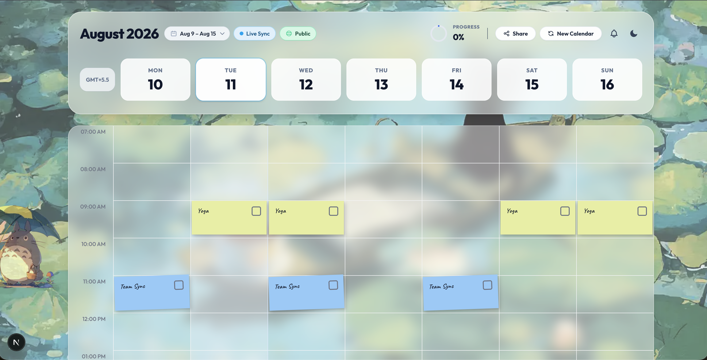

# 🌤️ Weekly Tracker

A beautiful, free-to-use weekly task planner with a cozy Studio Ghibli-inspired design. Plan your week on a visual time-grid, get reminders, and optionally share a live calendar link with friends, family, or teammates — no account required.

> **Free to use, not for resale.** You're welcome to use, self-host, and modify this project for personal or internal purposes, but you may not sell it, host it as a paid product, or redistribute it as your own. All rights remain with the original author — see the [License](#-license) section below.

Built with Next.js, React, TypeScript, and Tailwind CSS. Works fully offline as an installable PWA, and works instantly with **zero configuration** (no database required) or with **optional cloud sync** for cross-device / shareable calendars.



---

## ✨ Features

- **Visual weekly schedule** — a 7-day, hourly time grid (7 AM – 12 AM) with click-to-add tasks, automatic overlap layout, and a live "current time" indicator line.
- **Sticky-note task cards** — 12 pastel colors, multi-day assignment, quarter-hour duration stepper, and per-day completion tracking.
- **Reminders & notifications** — configurable lead time (0/5/10/15/30 min), in-app toasts, a notification drawer, optional native browser notifications, and sound alerts.
- **Progress ring** — an at-a-glance circular indicator of how much of your week is complete.
- **Dark / light themes** — a hand-tuned glassmorphism look in both modes.
- **Installable PWA** — add it to your home screen and use it fully offline (cached app shell via a custom service worker).
- **Shareable calendars** *(optional)* — generate a link to a calendar that syncs in real time across devices, with an optional passcode to keep it private.
- **Works without a database** — with no `DATABASE_URL` configured, everything is stored locally in your browser (`localStorage`) and the app works exactly the same way, just without cross-device sharing.
- **No sign-up, no tracking, no paywall** — this project is free to use and free to self-host, but not for resale (see [License](#-license)).

---

## 🧰 Tech Stack

| Layer | Technology |
| :--- | :--- |
| Framework | [Next.js](https://nextjs.org) 16 (App Router) |
| UI | [React](https://react.dev) 19, [Tailwind CSS](https://tailwindcss.com) v4 |
| Language | TypeScript |
| Icons | [lucide-react](https://lucide.dev) |
| Optional database | [Neon](https://neon.tech) (serverless Postgres) via `@neondatabase/serverless` |
| Testing | [Vitest](https://vitest.dev) |
| PWA | Custom service worker + Web App Manifest |

---

## 🚀 Getting Started

### Prerequisites

- Node.js 18+
- npm, yarn, or pnpm

### 1. Clone & install

```bash
git clone https://github.com/tanyas27/weekly-tracker.git
cd weekly-tracker
npm install
```

### 2. Run the dev server

```bash
npm run dev
```

Open [http://localhost:3000](http://localhost:3000) — that's it. By default the app runs entirely client-side using `localStorage`, so there's nothing else to configure.

### 3. (Optional) Enable shareable calendars with a database

To let people generate a shareable calendar link that syncs across devices, provision a free [Neon](https://neon.tech) Postgres database and set an environment variable:

```bash
# .env.local
DATABASE_URL="postgresql://<user>:<password>@<host>/<db>?sslmode=require"
```

Then create the required tables by running the schema against your database:

```bash
psql "$DATABASE_URL" -f lib/db/schema.sql
```

This creates the `calendars`, `sessions`, and `tasks` tables used for shareable/private calendars. If `DATABASE_URL` is not set, the app automatically falls back to local-only mode — no code changes needed.

---

## 📦 Available Scripts

```bash
npm run dev     # Start the development server
npm run build   # Create a production build
npm run start   # Run the production build
npm run lint    # Run ESLint
npm run test    # Run the Vitest test suite
```

---

## 📁 Project Structure

```
app/
  page.tsx          # Main scheduler UI
  layout.tsx        # Root layout, fonts, PWA metadata
  api/calendars/     # API routes for shareable calendars (optional, DB-backed)
  c/[calendarId]/    # Shareable calendar page route
components/          # TaskCard, ScheduleGrid, TaskModal, NotificationDrawer, etc.
hooks/                # useTasks, useNotifications, useLocalStorage, useCurrentTime
lib/                  # Reminder engine, task overlap logic, time utils, db layer
types/                # Shared TypeScript types (Task, Notification, etc.)
public/               # Icons, manifest.json, service worker, screenshots
```

---

## 🌐 Deployment

The easiest way to deploy is [Vercel](https://vercel.com/new):

1. Push this repo to your own GitHub account.
2. Import it into Vercel.
3. (Optional) Add a `DATABASE_URL` environment variable pointing to a Neon database to enable shareable calendars.
4. Deploy — no other configuration required.

---

## 🤝 Contributing

Issues and pull requests are welcome! Feel free to fork it, self-host it, or use it as a starting point for your own planner — just not to resell it (see below).

## 📄 License

This project is released under a custom [Free-Use, No-Resale License](LICENSE):

- ✅ Free to use, self-host, and modify for personal, educational, or internal purposes.
- ❌ You may **not** sell, resell, or redistribute the Software (or a modified/repackaged version of it) as a paid product or service.
- © All rights are retained by the original author.

For commercial licensing or resale permissions, please contact the author.
