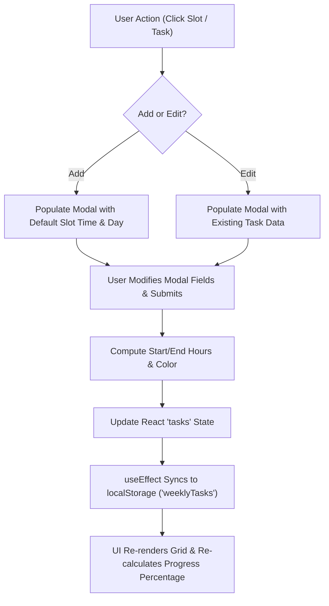

# KI-02: Data Models, Persistence & Reactive State Management

## 1. Primary TypeScript Interfaces

All core task and calendar data structures are defined in [app/page.tsx](../app/page.tsx).

### 1.1 Active Task (`Task`)
Represents an active task rendered in memory across the weekly schedule grid.
```typescript
interface Task {
  id: string          // Unique identifier (timestamp string e.g. "1723456789000")
  name: string        // Task title / description string
  startTime: string   // Formatted start time string (e.g. "09:00")
  endTime: string     // Calculated end time string (e.g. "10:30")
  startHour: number   // Fractional start hour (e.g. 9.5 for 9:30 AM)
  duration: number    // Task duration in decimal hours (e.g. 1.5)
  completed: boolean  // Overall completion status (true when completed on all assigned days)
  completedDays: string[] // Array of day abbreviations on which task is completed e.g. ["MON"]
  days: string[]      // Array of day abbreviations e.g. ["MON", "WED", "FRI"]
  color: string       // Tailwind CSS background color class string e.g. "bg-[#FFF9C4]"
}
```

### 1.2 Persisted Storage Task (`StoredTask`)
Represents the legacy and active schema format stored inside `localStorage`:
```typescript
interface StoredTask {
  id: string
  name: string
  startTime: string
  endTime: string
  startHour: number
  duration: number
  completed: boolean
  completedDays?: string[] // Per-day completion tracking array
  day?: string        // Legacy single-day field (for backwards compatibility)
  days?: string[]     // Multi-day selection array
  color: string
}
```

### 1.3 Day Information (`DayInfo`)
Generated dynamically for the active 7-day week starting from Monday:
```typescript
interface DayInfo {
  short: string       // Day abbreviation e.g. "MON", "TUE", "WED"
  date: number        // Day of month number (e.g. 15)
  fullDate: Date      // JavaScript Date object for the day
  isToday: boolean    // Boolean flag indicating if date matches today's date
}
```

---

## 2. Constants & Data Schemas

### 2.1 Time Slots (`TIME_SLOTS`) & Active Hours Preference (`ActiveHoursPreference`)
Defines the hourly timeline bounds for the full 24-hour day starting from 12:00 AM (24 distinct 80px slots):
```typescript
const TIME_SLOTS = [
  '12:00 AM', '01:00 AM', '02:00 AM', '03:00 AM', '04:00 AM', '05:00 AM',
  '06:00 AM', '07:00 AM', '08:00 AM', '09:00 AM', '10:00 AM', '11:00 AM',
  '12:00 PM', '01:00 PM', '02:00 PM', '03:00 PM', '04:00 PM', '05:00 PM',
  '06:00 PM', '07:00 PM', '08:00 PM', '09:00 PM', '10:00 PM', '11:00 PM',
]

interface ActiveHoursPreference {
  startHour: number // e.g. 6 (6 AM) or 4 (4 AM)
  endHour: number   // e.g. 23 (11 PM) or 19 (7 PM)
}
```
The schedule grid supports user-customizable active hours (e.g. 6 AM – 11 PM, Early Bird 4 AM – 10 PM, Workday 8 AM – 7 PM, or full 24h) with smart auto-expansion if tasks exist outside active bounds.

### 2.2 Pastel Sticky-Note Palette (`COLORS`)
A curated 12-color hex palette delivering warm Studio Ghibli pastel aesthetic styling:
```typescript
const COLORS = [
  'bg-[#FFF9C4]', // Light yellow
  'bg-[#FFE082]', // Yellow
  'bg-[#FFCC80]', // Peach
  'bg-[#FFAB91]', // Salmon pink
  'bg-[#E1BEE7]', // Light purple
  'bg-[#F48FB1]', // Pink
  'bg-[#90CAF9]', // Light blue
  'bg-[#B39DDB]', // Purple
  'bg-[#64B5F6]', // Blue
  'bg-[#A5D6A7]', // Green
  'bg-[#C5E1A5]', // Light green
  'bg-[#E6EE9C]', // Yellow-green
]
```

---

## 3. Storage Persistence & Migration Strategy

### 3.1 LocalStorage Keys
- **`weeklyTasks`**: Serialized JSON array of `StoredTask[]`.
- **`theme`**: Theme string preference (`"dark"` | `"light"`).

### 3.2 Backward Compatibility Deserialization
When tasks are loaded from `localStorage` in `getInitialTasks()`, legacy single-day objects (`day: "MON"`) are safely converted into multi-day arrays (`days: ["MON"]`):
```typescript
days: task.days?.length ? task.days : task.day ? [task.day] : []
```

### 3.3 Hydration Mismatch Protection
To prevent Next.js SSR hydration mismatches on page reloads, initial React state hooks (`useTasks`, `useNotifications`, `isDark`) initialize with default values on server and initial client render, and load persistent data from `localStorage` inside `useEffect` after mount (`isLoaded` / `isMounted`).

---


## 4. Derived & Memoized State Calculations

| Computed Value | React Hook | Description |
| :--- | :--- | :--- |
| `tasksByDay` | `useMemo` | Maps days (`"MON"`, `"TUE"`, etc.) to arrays of tasks assigned to that day. |
| `completedTasks` | `useMemo` | Counts total tasks marked with `completed: true`. |
| `progressPercentage` | Direct Calculation | Computes completion ratio `(completedTasks / totalTasks) * 100`. |
| `currentTimeTop` | Function | Computes pixel offset `(hour - 7) * 80` for rendering the red real-time horizontal marker. |
| `getTaskPosition` | Function | Calculates `{ top, height }` based on `startHour` and `duration`. |
| `overlapping` | In-render Filter | Identifies tasks occurring in the same time window to compute `leftOffset` and `rightOffset`. |

---

## 5. State Mutation Flow Diagram



## 6. Session Lifecycle & Lazy Database Creation

To prevent database clutter and ensure idempotent read operations:
1. **Read Operations (`GET /api/calendars/[calendarId]`)**:
   - `getSession` performs a read-only query.
   - If the week has never had tasks added, `activeSession` returns `null` and `tasks` returns `[]`. No row is written to the database on page visit.
2. **Write Mutations (`POST /api/calendars/[calendarId]/tasks`)**:
   - `getOrCreateSession` is lazily invoked only when a task is created, updated, or imported into that week.
3. **Session Querying (`getCalendarSessions`)**:
   - Queries `sessions` filtered by `EXISTS (SELECT 1 FROM tasks WHERE tasks.session_id = sessions.id)`. Empty viewed weeks never permanently pollute the dropdown.
4. **Monday Normalization (`normalizeToMonday`)**:
   - All session dates snap strictly to Monday (`YYYY-MM-DD`). Mid-week date drift is eliminated.
